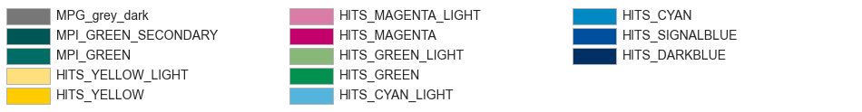
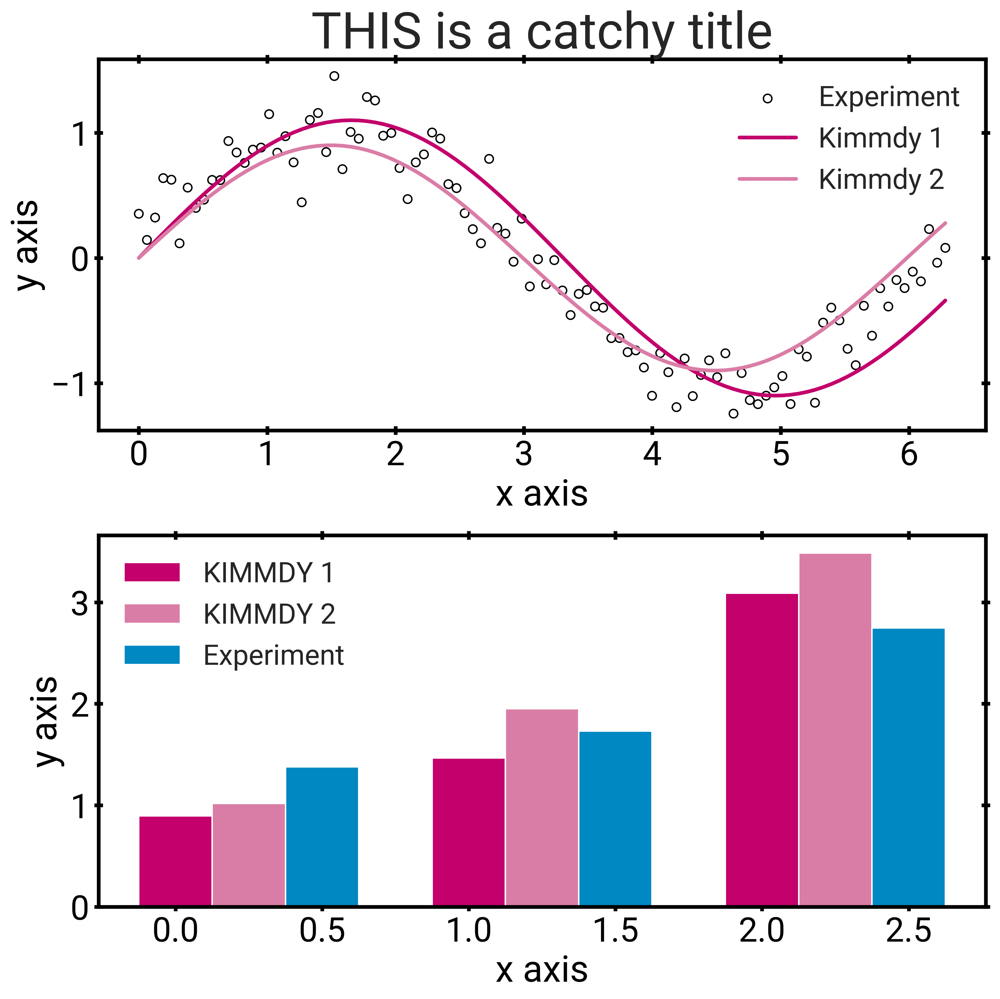

# Theme collection for the KIMMDY Emulators paper

## Install
Install using

```bash
pip install -e ./
```

To use do either

```python
import kimmdy_paper_theme
plot_colors = kimmdy_paper_theme.auto_init()
[...]
ax.plot(xs, ys, label="Kimmdy values", color=plot_colors["kimmdy"])
```

OR to manually control the settings

```python
import kimmdy_paper_theme

plot_config = kimmdy_paper_theme.default_plot_config  # Load custom plot configs

# If you want to adjust something for your custom figure use
# plot_config['legend.fontsize'] = 5

kimmdy_paper_theme.apply_plot_config(plot_config=plot_config)  # Apply custom matplotlib style

# If you don't have roboto installed, you can manually load it like this
kimmdy_paper_theme.init_roboto_font()

plot_colors = kimmdy_paper_theme.plot_colors  # These are the predefined colors

[...]

ax.plot(xs, ys, label="Kimmdy values", color=plot_colors["kimmdy"])
```

All matplotlib settings can be changed in [kimmdy_paper_theme.py](kimmdy_paper_theme/kimmdy_paper_theme.py)

## Colors

Current category colors are:



The currently available color palette:


## Example plot from [example_plot.py](example_usage/example_plot.py):



## SVG

Denis' SVG Icons can be found at [icons](kimmdy_paper_theme/assets/icons)